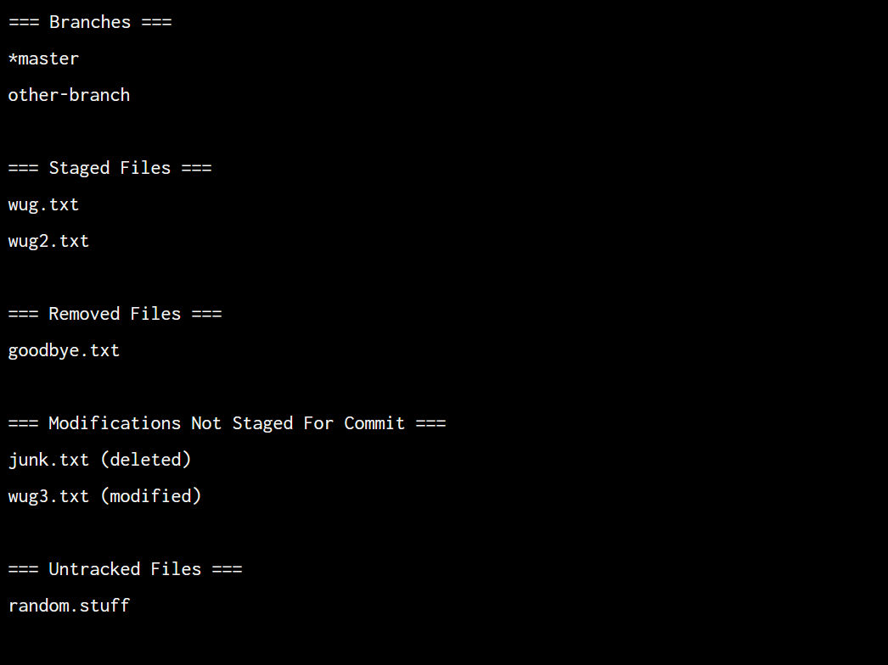

# Gitlet

Gitlet is a miniature version control system inspired by Git, designed to replicate some of the basic features of the Git software. This project is part of the coursework from CS61B Data Structures course, aiming to demonstrate an understanding of the concepts behind Git and to explore Java's file system manipulation capabilities.

## Features

Gitlet supports the following commands:

### Local Commands

- `init`: Initializes a new Gitlet version control system in the current directory.
- `add [filename]`: Adds a file to the staging area.
- `commit [message]`: Commits changes in the staging area with a given message.
- `rm [filename]`: Removes a file from the staging area or marks it for untracking.
- `log`: Displays a history of commits.
- `global-log`: Displays all commits made in the repository.
- `find [commit message]`: Displays all commits with a given message.
- `status`: Shows the status of the staging area and repository.
- `checkout`: Various forms to check out a branch, file, or commit.
- `branch [branch-name]`: Creates a new branch.
- `rm-branch [branch-name]`: Removes a branch.
- `reset [commit-id]`: Resets the current branch to the commit point.
- `merge [branch-name]`: Merges files from the given branch into the current branch.

### Remote Commands

- `add-remote [remote name] [remote directory]`: Adds a new remote to the repository.
- `rm-remote [remote name]`: Removes a remote from the repository.
- `push [remote name/branch]`: Pushes commits to the remote repository, updating the branch.
- `fetch [remote name/branch]`: Fetches branch updates from the remote repository.
- `pull [remote name/branch]`: Fetches branch updates and merges them into the current branch.

Example output of the **status** command:

## Acknowledgment

This project is a part of the coursework for Berkeley's CS61B: Data Structures. For detailed project description, please look at:
https://sp21.datastructur.es/materials/proj/proj2/proj2
